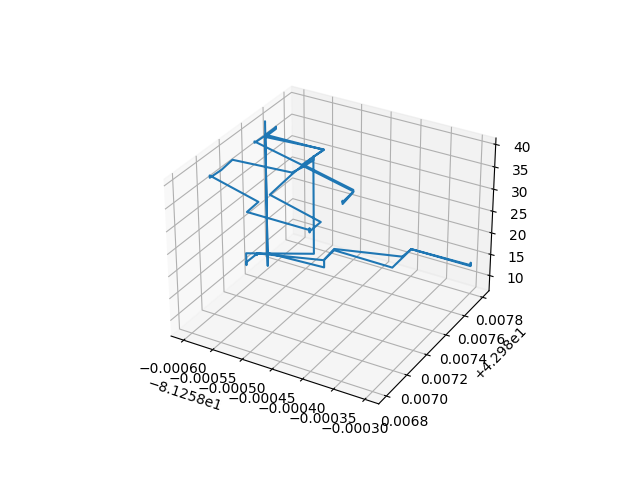

# DJI3D


DJI3D is a tool for graphing 3d positional data extracted from DJI drone telemetry. Many DJI drones have the option to save basic flight telemetry data inside subtitle tracks on recorded videos. This script will extract this data and export it in one of three formats:

 - 3D graph
   - Takes GPS data, and plots it with matplotlib
 - JSON
   - A raw, timestamped JSON dump
 - CSV
   - A timestamped CSV log

## Usage

```
usage: dji3d [-h] [-i] [-f {graph,csv,json}] [-o OUTPUT] input

DJI3D is a tool for graphing 3d positional data extracted from DJI drone telemetry

positional arguments:
  input                 Raw drone video file with telemetry data

optional arguments:
  -h, --help            show this help message and exit
  -i, --interactive     Run interactively
  -f {graph,csv,json}, --format {graph,csv,json}
                        Output format
  -o OUTPUT, --output OUTPUT
                        Output location
```

## Installing

```sh
python3 -m pip install dji3d
```

## Example

